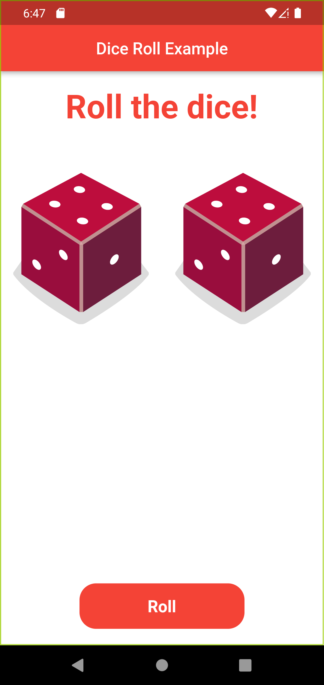

# Dice Roll Example

Simple example of a dice roll using flutter where we generate two random numbers and show respective dice images.

## Getting Started
- Clone the repo
- Run `flutter pub get` to install dependencies
- Run `flutter run` to run the app

## Screenshots

